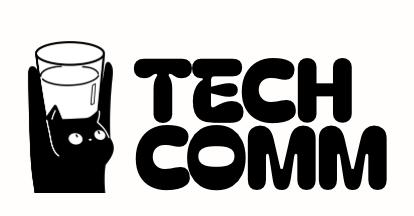

<div align="center">



# Git Workshop
**CAPT 15CSC Tech Comm | Contributor Wall**

Make your own profile card by editing JSON, submit a pull request, and see it on the workshop website.

[View the Contributor Wall](https://tyh71.github.io/CAPT-Tech-Comm-Git-Workshop/)
</div>

## Start here

Create a profile card to practise **branch → edit → commit → push → pull request**.
You only edit a JSON file (a text file containing your details); no HTML or CSS is needed.
After a host merges your pull request into `main`, GitHub publishes your card.

You need **Git**, a **GitHub account**, and a **text editor** such as VS Code.
Local checks require Node.js 20; the optional browser preview also uses Python 3.

### Clone the repository

Open your terminal. If the host has given you write access, run:

```sh
git clone https://github.com/TYH71/CAPT-Tech-Comm-Git-Workshop.git
cd CAPT-Tech-Comm-Git-Workshop
```

Without write access, click **Fork** on GitHub to create your own copy first.
Replace `YOUR-GITHUB-USERNAME` below with your username, then run:

```sh
git clone https://github.com/YOUR-GITHUB-USERNAME/CAPT-Tech-Comm-Git-Workshop.git
cd CAPT-Tech-Comm-Git-Workshop
```

**Next: [follow the participant guide](participants/README.md)** to create your
branch, fill in the template, and submit your card.

## Git terms used in this workshop

| Term | Meaning |
| --- | --- |
| Repository (repo) | The project files and their saved history. |
| Clone | Download the repository to your computer. |
| Branch | A separate line of work for your changes. `main` is the shared version. |
| Stage (`git add`) | Select changes to include in your next commit. |
| Commit | Save selected changes as a local checkpoint. |
| Push | Upload your commits to GitHub. |
| Pull request (PR) | Ask the host to review and merge your branch into `main`. |
| Merge | Bring your branch's changes into another branch. |
| Deploy | Publish the updated website. |

## Repository structure

```text
assets/                       Original CAPT and Tech Comm logos
participants/
  README.md                   Participant template and submission guide
  your-name/
    profile.json              Your editable details
    portrait.jpg              Optional photo
template/
  profile.json                Copy this file to start
  index.html                  Shared layout, maintained by the host
  style.css                   Shared profile card styling
scripts/
  build-collage.mjs            Validate JSON and generate the site
  check-collage.mjs            Build and validation regression checks
.github/workflows/deploy.yml   GitHub Pages build and deployment
```

The participant path above is illustrative; `participants/yuhoe/` contains a working profile.

## For the host

1. In **Settings → Pages → Build and deployment**, select **GitHub Actions**.
2. Give participants write access, or ask them to fork the repository.
3. Review and merge their pull requests into `main`.
4. Check the **Actions** tab to confirm deployment succeeded.

Consider protecting `main` and requiring review before merges.
Before merging generator or template changes, run from the repository root:

```sh
node scripts/check-collage.mjs
node scripts/build-collage.mjs
```

The checks cover generated cards, branding, photos, and invalid profile data.
The builder validates all profiles, then generates the gallery and individual
card pages in `dist/`. Generated files are ignored by Git; do not commit them.
Only generated HTML and referenced photos are published from participant folders.

The deployment workflow runs on pushes to `main` or manual runs from **Actions**.
It runs the builder, but does not run the regression checks or check pull requests.
Invalid profile data stops that run from deploying.

For older submissions, use [template/profile.json](template/profile.json):
move HTML-only profiles into JSON, add `telegram`, and remove `heading` and `bounty`.

## Reference workshop

Adapted from [AngKS's SUTD Git Gud workshop](https://github.com/AngKS/SUTD-Git-Gud-2026-Workshop).
See its [original activity website](https://angks.github.io/SUTD-Git-Gud-2026-Workshop/)
for the source workshop. This CAPT version uses its own branding and JSON submissions.
Reference slide decks and illustrations are not bundled in this repository.
